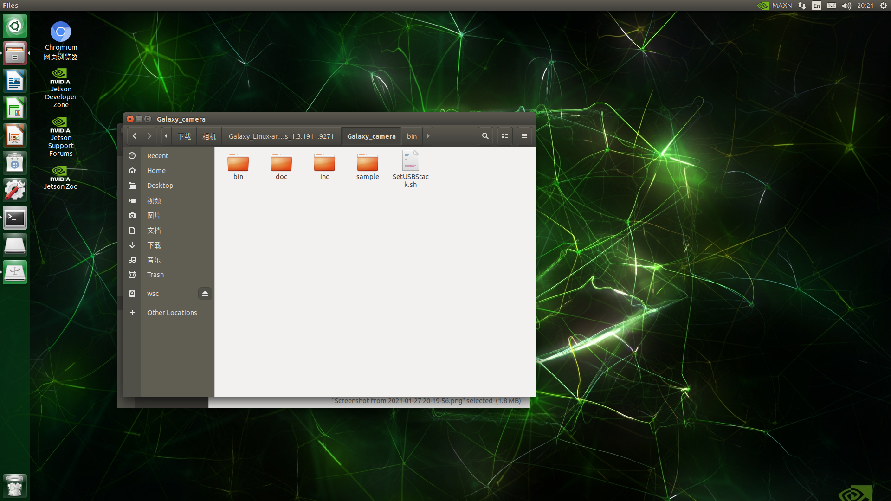
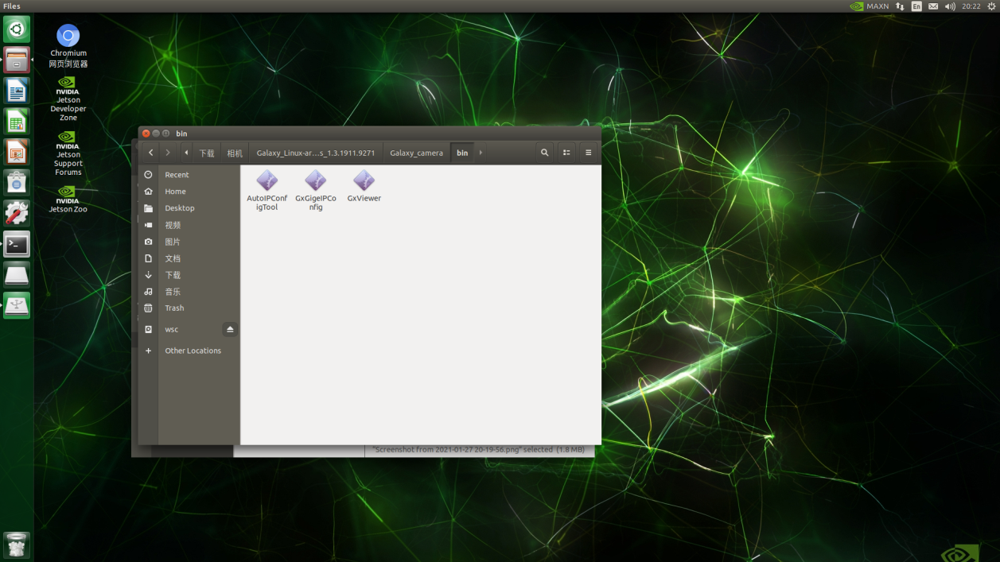

----------
# 关于大恒相机的使用说明
----------
#### 最新调试修订2021.8.14

## 目录

* [0.文件目录结构及文件用途说明](#0文件目录结构及文件用途说明)

* [1.下载软件包](#1下载软件包)

* [2.安装相机驱动](#2安装相机驱动)

* [3.安装相机gxipy库](#3安装相机gxipy库)

* [4.打开摄像头采集图像](#4打开摄像头采集图像)

* [6.打开摄像头录制图像](#6打开摄像头录制图像)

* [7.补充说明](#7补充说明)


## 0.文件目录结构及文件用途说明
----------

``` 
camera\
│ get_video.py  				读取本地摄像头
│ use_DaHeng_get_picture.py 		使用大恒工业相机采集图像
│ use_DaHeng_get_video.py 		使用大恒工业相机采集视频
│  README.md
```
 ## 1.下载软件包
 ----------


(https://www.daheng-imaging.com/details/index.aspx?nodeid=297)
下载下图两个软件至jetson nano，并解压


 ## 2.安装相机驱动
 ----------

```
步骤1：在文件夹Galaxy_Linux-armhf_Gige-U3_32bits-64bits_1.3.1911.9271中打开终端

步骤2：执行：./Galaxy_camera.run ；（按提示输入Y，中间有一次问你安装中文或英文，其他则输入Y即可）；

安装完成则产生以下文件：
```





## 3.安装相机gxipy库
 ----------

```

步骤1：在Galaxy_Linux_Python_2.0.2008.9111文件夹中打开终端
```

###安装依赖环境

```

·步骤2：
sudo apt-get install python3.x

·步骤3：
sudo apt-get install python3.x-dev

·步骤4：
sudo apt-get install python3-setuptools
```

###安装gxipy库

```
·步骤5：
cd ./api 

·步骤6：
python3 setup.py build   

·步骤7：
sudo python3 setup.py install 
(若在python中执行import gxipy未报错则安装成功)

·步骤8：
sudo apt-get install python3-pip

·步骤9：
sudo pip3 install numpy==1.9.0

·步骤10：
sudo pip3 install pillow
（若失败则执行后再试：sudo apt-get install libjpeg8 libjpeg62-dev libfreetype6 libfreetype6-dev）
```

## 4.打开摄像头采集图像
----------

###步骤1：导入必要库
```
import gxipy as gx
from PIL import Image
import numpy
import cv2
```

###步骤2：枚举设备。

####dev_info_list 是设备信息列表,列表的元素个数为枚举到的设备个数,列表元素是字典,其中包含设备索引(index)、ip 信息(ip)等设备信息

```

device_manager = gx.DeviceManager()

dev_num, dev_info_list = device_manager.update_device_list()

if dev_num == 0:

	sys.exit(1)
```

###步骤3：打开设备

#### 获取设备基本信息列表

```

strSN = dev_info_list[0].get("sn")
```

#### 通过序列号打开设备

```

cam = device_manager.open_device_by_sn(strSN)
```

###步骤4：开始采集

```

cam.stream_on()

```

#### 获取流通道个数

#### 如果 int_channel_num == 1,设备只有一个流通道,列表 data_stream 元素个数为 1

#### 如果 int_channel_num > 1,设备有多个流通道,列表 data_stream 元素个数大于 1

#### 目前千兆网相机、USB3.0、USB2.0 相机均不支持多流通道。

##### int_channel_num = cam.get_stream_channel_num()

#### 获取数据

#### num 为采集图片次数

```

num = 10

for i in range(num):

	##### 从第 0 个流通道获取一幅图像

	raw_image = cam.data_stream[0].get_image()

	##### 从彩色原始图像获取 RGB 图像

	rgb_image = raw_image.convert("RGB")

	if rgb_image is None:

		continue

	##### 从 RGB 图像数据创建 numpy 数组

	numpy_image = rgb_image.get_numpy_array()

	if numpy_image is None:

		continue

	##### 显示并保存获得的 RGB 图片

	image = Image.fromarray(numpy_image, 'RGB')

	image.show()

	image.save(str(i)+"image.jpg")
```

###步骤5：停止采集，关闭设备

```
cam.stream_off()

cam.close_device()
```

## 6.打开摄像头录制图像
----------

###步骤1：导入必要库

```

import gxipy as gx

from PIL import Image

import numpy

import cv2
```

###步骤2：打开设备

```

device_manager = gx.DeviceManager() 

dev_num, dev_info_list = device_manager.update_device_list()

if dev_num == 0:

		sys.exit(1)
```

#### 获取设备基本信息列表

```

str_sn = dev_info_list[0].get("sn")
```

#### 通过序列号打开设备

```

cam = device_manager.open_device_by_sn(str_sn)
```

###步骤3：开始采集

```
	cam.stream_on()

```

###步骤4：视频参数获取与设置

// 获取帧率

//fps = cam.AcquisitionFrameRate.get()  

# 视频的宽高

```

size = (int(cam.Width.get()),int(cam.Height.get()))

fourcc = cv2.VideoWriter_fourcc(*'XVID')

out = cv2.VideoWriter('2.avi',fourcc,fps = 30,size)
```

###步骤5：写入文件

```

while (1):

   		cap = cam.data_stream[0].get_image()

		cap = cap.convert("RGB")

		frame = cap.get_numpy_array()

		frame = cv2.cvtColor(frame,cv2.COLOR_BGR2RGB)
		
		if cap is None:

			continue

		//frame = cv2.flip(frame,1)		

		out.write(frame)

		cv2.imshow('origin', frame)

		if cv2.waitKey(1) == ord('q'):

			break
```

###步骤6：停止采集，关闭设备

```

cv2.destroyWindow('origin')
```

#### 停止采集

```

cam.stream_off()
```

####释放

```

out.release()

// close device

cam.close_device()

cv2.destroyAllWindows()
```

## 7.补充说明
----------

###以下函数应在图像采集开始前调用

#### set exposure 设置曝光时间

```

cam.ExposureTime.set(500)
```

#### set gain 设置增益

```

cam.Gain.set(0)
```

#### set width/height 设置宽/高

```

cam.Width.set(500)
cam.Height.set(500)
```

#### set White balance 根据通道设置白平衡系数
 
• 0是红通道
• 1是绿通道
• 2是蓝通道

```
    cam.BalanceRatioSelector.set(0)

   • 设置值    

    cam.BalanceRatio.set(2.2)   

    cam.BalanceRatioSelector.set(1)
    cam.BalanceRatio.set(1)

    cam.BalanceRatioSelector.set(2)
    cam.BalanceRatio.set(2.2)
```

    #### 保存参数组

```
    • User Set Selector
    cam.UserSetSelector.set(1)
    • User Set Save
    cam.UserSetSave.send_command()
```

| 自动白平衡的自定义函数：
| ---------------------------------------------------------------------------	|
|  • 可以用该函数替换掉“frame = cv2.cvtColor(frame,cv2.COLOR_BGR2RGB) ”		|
| ---------------------------------------------------------------------------	|
| def whiteBalance(img):							|
|	r,g,b = cv2.split(img)							|
|	r_avg = cv2.mean(r)[0]							|
|	g_avg = cv2.mean(g)[0]							|
|	b_avg = cv2.mean(b)[0]							|
|	k = (r_avg + g_avg + b_avg)/3						|
|	kr = k / r_avg								|
|	kg = k / g_avg								|
|	kb = k / b_avg								|
|	r = cv2.addWeighted(src1 = r,alpha = kr,src2 = 0,beta = 0, gamma = 0)	|
|	g = cv2.addWeighted(src1 = g,alpha = kg,src2 = 0,beta = 0, gamma = 0)	|
|	b = cv2.addWeighted(src1 = b,alpha = kb,src2 = 0,beta = 0, gamma = 0)	|
|	balance_img = cv2.merge([b,g,r])					|
|										|
|	return balance_img							|


